# Architectural Decision System - Management Review

**Reviewer:** Technical Manager Perspective
**Date:** 2025-10-12
**Review Type:** Process Effectiveness & Practical Usability
**Overall Rating:** 7.5/10 (Good foundation, needs refinement)

---

## Executive Summary

**Strengths:**
- ✅ Comprehensive framework addresses real past issues
- ✅ Well-integrated into existing workflow
- ✅ Automated tooling to reduce manual overhead
- ✅ Good documentation and discoverability

**Concerns:**
- ⚠️ Risk of process becoming too heavy for single AI developer
- ⚠️ Unclear decision authority (when can Claude proceed without user?)
- ⚠️ No examples or worked scenarios in framework
- ⚠️ Missing feedback mechanisms and iteration paths
- ⚠️ Overhead may slow down legitimate architectural improvements

**Recommendation:** APPROVE with conditions - implement 8 critical improvements before declaring production-ready.

---

## Detailed Review by Category

### 1. Process Design ⭐⭐⭐⭐ (4/5)

**What Works Well:**
- Clear trigger list (high/medium/low risk)
- Systematic 30-minute review process
- Decision matrix with weighted criteria
- Links past mistakes to prevention

**Concerns:**

#### 🔴 CRITICAL: Ambiguous Decision Authority
**Issue:** Framework says "Present to user for HIGH-RISK" but doesn't specify:
- What if user is unavailable? (blocks development)
- Can Claude proceed with score > 8.5/10?
- What about time zones / async work?
- Emergency situations?

**Impact:** Could block all significant work or cause Claude to be overly cautious

**Recommendation:**
```markdown
## Decision Authority Matrix

| Risk Level | Score | User Approval Required? | Claude Can Proceed If... |
|------------|-------|-------------------------|--------------------------|
| HIGH       | ≥ 8.5 | Optional (notify)       | Score ≥ 8.5 AND ADR created AND no security/data loss risk |
| HIGH       | 7.0-8.4 | Required               | User approves within 24h OR marks as "Claude decide" |
| HIGH       | < 7.0 | Required + Discussion   | User actively discusses alternatives |
| MEDIUM     | ≥ 7.0 | No (create ADR)        | ADR documented |
| MEDIUM     | < 7.0 | Optional (notify)      | Claude's judgment with ADR |
| LOW        | Any   | No                     | Proceed |

**Emergency Override:** If blocking critical bug or security issue, Claude can proceed with
HIGH-RISK changes if (1) documented in ADR with "EMERGENCY OVERRIDE" status and
(2) user notified immediately.
```

#### 🟡 MODERATE: No Practical Examples
**Issue:** Framework is abstract - no worked examples showing:
- How to actually score in decision matrix
- What a good ADR looks like for this project
- How to handle common scenarios

**Impact:** First use will be slow, potential misunderstanding

**Recommendation:** Add section to ARCHITECTURAL_DECISION_FRAMEWORK.md:
```markdown
## 📚 Worked Examples

### Example 1: Adding New Dependency (numpy for statistics)

**Problem:** Need to calculate standard deviation for hand strength analysis

**Alternative A: Add numpy dependency**
- Maintainability: 9/10 (well-maintained library)
- Testability: 10/10 (pure functions)
- Future-proofing: 8/10 (may need more stats functions)
- Effort: 2/10 (1 hour - just pip install)
- Risk: 8/10 (stable, widely used)
- Performance: 10/10 (optimized C code)
**Score: 8.2/10**

**Alternative B: Implement own calculation**
- Maintainability: 6/10 (custom code to maintain)
- Testability: 8/10 (can test)
- Future-proofing: 4/10 (limited to just std dev)
- Effort: 7/10 (2-3 hours)
- Risk: 6/10 (potential bugs in math)
- Performance: 7/10 (pure Python slower)
**Score: 6.1/10**

**Alternative C: Use built-in statistics module**
- Maintainability: 10/10 (Python stdlib)
- Testability: 10/10 (well tested)
- Future-proofing: 7/10 (limited functionality)
- Effort: 10/10 (already available)
- Risk: 10/10 (no new dependency)
- Performance: 8/10 (good enough)
**Score: 9.0/10** ✅ WINNER

**Decision:** Use statistics.stdev() from Python stdlib
**Rationale:** Meets needs, zero dependencies, built-in
**ADR:** ADR-0001 (hypothetical)
```

#### 🟡 MODERATE: Time Estimates May Be Unrealistic
**Issue:** "30 minutes" for architectural review sounds good but:
- First time through will take 60-90 minutes
- Complex decisions (e.g., modular architecture) need hours, not 30 min
- Forces rushing for complex decisions

**Impact:** Either process is skipped OR unrealistic expectations

**Recommendation:**
```markdown
## Time Estimates (Realistic)

**Simple Decisions** (new dependency, config change): 15-30 minutes
- Example: "Should we use library X or Y?"

**Moderate Decisions** (new module, API change): 45-60 minutes
- Example: "How should we structure this new feature?"

**Complex Decisions** (major refactoring, architecture change): 2-4 hours
- Example: "Should we adopt microservices architecture?"

**Rule:** Time-box to these limits. If exceeding, escalate to user for discussion.
```

### 2. Tooling ⭐⭐⭐⭐½ (4.5/5)

**What Works Well:**
- Two complementary scripts (triggers + compliance)
- Executable and integrated into git workflow
- Good exit codes for automation
- HTML report option for compliance

**Concerns:**

#### 🟡 MODERATE: Scripts Not Tested
**Issue:** No evidence scripts have been run or work correctly
- Verification doc says "[ ] Test trigger detection script"
- No test suite for the scripts themselves
- What if script has bugs and gives false positives/negatives?

**Impact:** Could undermine confidence in system

**Recommendation:**
```bash
# Create test suite
# File: .claude/scripts/test_architectural_tools.sh

# Test 1: Trigger detection with sample changes
echo "Testing trigger detection..."
# Create temporary test scenarios

# Test 2: Compliance report generation
echo "Testing compliance report..."
python3 .claude/scripts/architectural_compliance_report.py --verbose

# Test 3: Exit codes
echo "Testing exit codes..."
# Verify returns 0, 1, or 2 as expected

# Run this before declaring system complete
```

#### 🟢 MINOR: No Integration with CI/CD
**Issue:** Scripts exist but not integrated into GitHub Actions
- Current CI only runs tests and documentation compliance
- No architectural compliance check in PR workflow

**Impact:** Lower adoption, manual running required

**Recommendation:** Add to `.github/workflows/`:
```yaml
# .github/workflows/architecture.yml
name: Architectural Compliance

on: [pull_request]

jobs:
  check-architecture:
    runs-on: ubuntu-latest
    steps:
      - uses: actions/checkout@v2
      - name: Check for architectural triggers
        run: |
          python3 .claude/scripts/check_architectural_triggers.py --verbose
          exit_code=$?
          if [ $exit_code -eq 2 ]; then
            echo "::warning::HIGH-RISK architectural changes detected. Review ADR required."
          fi

      - name: Generate compliance report
        run: |
          python3 .claude/scripts/architectural_compliance_report.py --html -o compliance.html

      - name: Upload report
        uses: actions/upload-artifact@v2
        with:
          name: architectural-compliance
          path: compliance.html
```

### 3. Documentation ⭐⭐⭐⭐ (4/5)

**What Works Well:**
- Comprehensive framework document
- Clear ADR template
- Good integration into existing docs
- Multiple entry points for discovery

**Concerns:**

#### 🟡 MODERATE: Document Overload Risk
**Issue:** Added 1,190 lines of new documentation:
- ARCHITECTURAL_DECISION_FRAMEWORK.md: 554 lines
- ARCHITECTURAL_DECISION_SYSTEM.md: 485 lines
- decisions/README.md: 151 lines

Combined with existing 40+ doc files, this adds complexity.

**Impact:** Ironic - system to reduce documentation overhead adds significant docs

**Recommendation:**
1. **Consolidate:** Merge ARCHITECTURAL_DECISION_SYSTEM.md content into main framework
2. **TL;DR Section:** Add 1-page quick reference at top of framework:
```markdown
## 🚀 TL;DR (Read This First)

**For 90% of cases, you need this:**

1. Check triggers: `python3 .claude/scripts/check_architectural_triggers.py --verbose`
2. If HIGH-RISK: Generate 3 alternatives, score them, pick best
3. Create ADR: Copy template, fill in sections
4. If score ≥ 8.5: Proceed (notify user)
   If score < 8.5: Get user approval first

**Read the rest when you need details.**
```

#### 🟢 MINOR: No Visual Diagrams
**Issue:** All text, no diagrams
- Process flow is described in text
- Decision matrix is a table
- No visual representation of trigger detection

**Impact:** Harder to grasp at a glance

**Recommendation:** Add simple ASCII or Mermaid diagrams:

```mermaid
graph TD
    A[Start Task] --> B{Check Triggers}
    B -->|No Triggers| C[Proceed Normally]
    B -->|LOW Risk| D[Quick Check]
    B -->|MEDIUM Risk| E[30-min Review]
    B -->|HIGH Risk| F[Full Review + ADR]
    F --> G{Score ≥ 8.5?}
    G -->|Yes| H[Create ADR + Proceed]
    G -->|No| I[Get User Approval]
    I --> J{Approved?}
    J -->|Yes| H
    J -->|No| K[Iterate on Design]
```


### 4. ADR System ⭐⭐⭐⭐ (4/5)

**What Works Well:**
- Good template structure
- Sequential numbering system
- Status workflow defined
- Meta-ADR (ADR-0000) explains system

**Concerns:**

#### 🟡 MODERATE: No ADR Maintenance Process
**Issue:** System for creating ADRs, but not maintaining them:
- When to mark as "Superseded"?
- How often to review old ADRs?
- Who updates index?
- What if decision was wrong?

**Impact:** ADRs become stale, index becomes outdated

**Recommendation:** Add to decisions/README.md:
```markdown
## ADR Maintenance

### Quarterly Review (Every 3 Months)
- Review all "Accepted" ADRs
- Mark outdated ones as "Deprecated" or "Superseded"
- Update index
- Extract patterns into framework

### When to Update an ADR
- **Never edit existing ADR** (preserve history)
- **Create new superseding ADR** that references old one
- **Mark old ADR** with "Superseded by ADR-NNNN"

### Handling Wrong Decisions
If an ADR decision proves wrong:
1. Create ADR-NNNN-reversal-of-XXXX.md
2. Document what went wrong
3. Document new approach
4. Update framework to prevent similar mistakes

This creates a learning trail, not a cover-up.
```

#### 🟢 MINOR: No ADR Search/Discovery
**Issue:** Only way to find ADRs is:
- Read README.md index (manual)
- Browse directory

No way to search by topic, risk level, date, etc.

**Impact:** As ADRs grow (10, 20, 50), hard to find relevant precedents

**Recommendation:** Add tags to ADR template:
```markdown
# ADR-NNNN: Title

**Tags:** #dependency #refactoring #high-risk
**Related Components:** engine/bidding_engine.py, server.py
**Risk Level:** HIGH
```

Then add search script:
```bash
# .claude/scripts/search_adrs.py
# Search by tag, component, risk level, date range
```

### 5. Integration & Adoption ⭐⭐⭐ (3/5)

**What Works Well:**
- Integrated into checklists
- Prominent in PROJECT_CONTEXT.md
- Auto-loads via .claude/ directory

**Concerns:**

#### 🔴 CRITICAL: No Feedback Loop for Process Improvement
**Issue:** System is built but no mechanism to improve it:
- No "How's this working?" check-in
- No metrics on actual time spent
- No tracking of decisions made with vs without framework
- No user satisfaction survey

**Impact:** Process may be too heavy/light and never gets adjusted

**Recommendation:**
```markdown
## 📊 Process Feedback & Improvement

### After Each ADR (Immediate Feedback)
Claude adds to ADR:
```
## Process Feedback
- **Time Spent:** [Actual time for review]
- **Process Followed:** [Yes/No and why]
- **User Satisfaction:** [1-5 scale]
- **What Worked:** [Brief note]
- **What Didn't:** [Brief note]
```

### Monthly Review (1st of Month)
User and Claude review:
1. All ADRs created this month
2. Process feedback notes
3. Adjust framework if needed
4. Update time estimates if consistently off

### Success Metrics (Track Monthly)
- Number of HIGH-RISK changes caught
- Average time for architectural review
- User satisfaction score (avg)
- Number of refactorings avoided (qualitative)
```

#### 🟡 MODERATE: Risk of "Process Theater"
**Issue:** Comprehensive process that might become:
- Checkbox exercise (fill out forms but don't think deeply)
- Burden that gets skipped under time pressure
- Overly rigid for creative architectural thinking

**Impact:** Either process is ignored OR it stifles innovation

**Recommendation:**
```markdown
## ⚡ When to Skip the Process (Yes, Really)

**The process is a tool, not a religion.**

**You CAN skip if:**
1. **Prototyping:** Exploring ideas, will throw away
2. **Spike Solutions:** Time-boxed investigation (< 4 hours)
3. **Revert in Progress:** Undoing a change
4. **Following Recent ADR:** Implementing already-approved design

**BUT:** Mark with comment in code:
```python
# ARCHITECTURAL_REVIEW_DEFERRED: Prototyping phase
# Will formalize before merge to main
```

**Golden Rule:** Better to do thoughtful review 80% of the time
than mechanical checkbox 100% of the time.
```

#### 🟢 MINOR: No Onboarding for New Claude Sessions
**Issue:** System assumes Claude remembers everything
- What if new session starts fresh?
- How does Claude learn the system quickly?

**Impact:** Inconsistent application across sessions

**Recommendation:** (Already addressed by QUICK_REFERENCE.md, but emphasize):
```markdown
## 🎯 New Session Onboarding (5 minutes)

**First time using this system?**
1. Read this TL;DR (above)
2. Skim one example ADR: ADR-0000
3. Run trigger detection once to see output
4. Read one worked example (when added)

**You're ready.** Learn details as needed.
```

### 6. Risk Management ⭐⭐⭐⭐ (4/5)

**What Works Well:**
- Addresses real past issues
- Risk categorization (high/medium/low)
- Mitigation strategies documented

**Concerns:**

#### 🟡 MODERATE: No "Escape Hatch" for Urgency
**Issue:** Framework says "MUST review" for HIGH-RISK but:
- Production down, need hot fix
- Security vulnerability needs immediate patch
- Critical bug blocking all users

**Impact:** Process could force choosing between safety and speed

**Recommendation:** Already mentioned in decision authority, but emphasize:
```markdown
## 🚨 Emergency Protocol

**If production issue or security vulnerability:**

1. **Fix it immediately** (no review required)
2. **Create "EMERGENCY" ADR** within 24 hours:
   - What broke
   - What you changed
   - Why no review
   - Post-mortem: Should we have caught this earlier?
3. **Schedule post-incident review** (1 week later)
   - Was this preventable?
   - Update framework to prevent recurrence

**Examples of valid emergencies:**
- Production outage affecting users
- Security vulnerability (CVE)
- Data loss in progress
- Complete feature broken (not just bug)

**NOT emergencies:**
- "I want to ship this feature faster"
- "I forgot to do the review earlier"
- "The review seems like too much work"
```

### 7. Measurement & Metrics ⭐⭐ (2/5)

**What Works Well:**
- Compliance report script exists
- Some metrics identified (god classes, dependencies)

**Concerns:**

#### 🔴 CRITICAL: No Baseline Captured
**Issue:** Verification doc says "[ ] Run baseline compliance report" but:
- Not done before declaring complete
- Can't measure improvement without baseline
- No way to know if system is working

**Impact:** Cannot demonstrate value of system

**Recommendation:** **BLOCK COMPLETION** until:
```bash
# 1. Capture baseline NOW
python3 .claude/scripts/architectural_compliance_report.py --verbose > baseline_2025-10-12.txt

# 2. Schedule follow-up measurements
# - 1 month later
# - 3 months later
# - 6 months later

# 3. Track these metrics:
# - God classes (count)
# - Global state instances (count)
# - Circular dependencies (count)
# - Average dependencies per module
# - ADRs created (count)
# - HIGH-RISK changes caught (count)
# - Refactorings avoided (qualitative)
```

#### 🟡 MODERATE: No Velocity Tracking
**Issue:** Goal is "minimize velocity loss" but:
- No measurement of velocity before/after
- No tracking of time spent on architecture vs coding
- No way to know if 30-minute reviews are worth it

**Impact:** Can't prove ROI of system

**Recommendation:**
```markdown
## Velocity Metrics (Track Monthly)

**Before System (Baseline - October 2025):**
- Features completed: [X]
- Time spent on refactoring: [Y hours]
- Architectural issues discovered: [Z]

**After System (Each Month):**
- Features completed: [X]
- Time spent on architectural review: [Y hours]
- Time spent on refactoring: [Z hours]
- Architectural issues prevented: [W]

**ROI Calculation:**
If (time_saved_on_refactoring - time_spent_on_review) > 0:
    System is working ✅
```

### 8. User Experience (Your Experience) ⭐⭐⭐ (3/5)

**What Works Well:**
- Clear documentation
- Prominent placement in docs
- Integrated into workflow

**Concerns:**

#### 🟡 MODERATE: User Not Clear on Their Role
**Issue:** User (you) needs to know:
- When will Claude ask for approval?
- How should I review Claude's architectural analysis?
- What if I disagree with Claude's recommendation?
- How do I know system is being used?

**Impact:** Unclear expectations, potential friction

**Recommendation:** Add USER_GUIDE.md:
```markdown
# Architectural Decision System - User Guide

## Your Role as User

**Claude will present HIGH-RISK architectural decisions to you:**

### What You'll See
```
I've detected HIGH-RISK architectural changes for [feature].

RECOMMENDATION: [Option A] (Score: 8.5/10)

KEY BENEFITS:
- [Benefit 1]
- [Benefit 2]

TRADE-OFFS:
- [Trade-off 1]
- [Trade-off 2]

I've created ADR-NNNN documenting this decision.
The alternatives were [B] (score 6.5) and [C] (score 5.0).

Shall I proceed with [Option A]?
```

### How to Review
1. **Read the ADR** (in docs/architecture/decisions/)
2. **Check the scoring** (does it match your priorities?)
3. **Consider trade-offs** (are they acceptable?)
4. **Ask questions** if unclear

### Your Response Options
- "Yes, proceed" → Claude implements
- "No, use Option B instead" → Claude switches
- "Tell me more about..." → Claude explains
- "Let me think about it" → Claude waits
- "This isn't HIGH-RISK" → Adjust framework

### Monitoring System
Weekly, check:
```bash
# See what ADRs were created
ls docs/architecture/decisions/

# Run compliance report
python3 .claude/scripts/architectural_compliance_report.py --html -o report.html
```
```

---

## Priority Improvements

### CRITICAL (Must Fix Before Production Use)

1. **Define Decision Authority** (see section 1)
   - Add authority matrix to framework
   - Clarify when Claude can proceed without user
   - Add emergency protocol

2. **Capture Baseline Metrics** (see section 7)
   - Run compliance report NOW
   - Document current state
   - Set up tracking

3. **Add Feedback Loop** (see section 5)
   - Process feedback in each ADR
   - Monthly review cadence
   - Metrics tracking

### HIGH PRIORITY (Should Add Soon)

4. **Add Worked Examples** (see section 1)
   - 2-3 realistic scenarios
   - Show actual scoring
   - Demonstrate good ADR

5. **Test the Scripts** (see section 2)
   - Create test suite
   - Verify scripts work
   - Document any issues

6. **Create User Guide** (see section 8)
   - Clarify user role
   - Set expectations
   - Show how to monitor

### MEDIUM PRIORITY (Nice to Have)

7. **Add Visual Diagrams** (see section 3)
   - Process flow diagram
   - Decision tree visual
   - Quick reference graphic

8. **Integrate with CI/CD** (see section 2)
   - Add GitHub Actions
   - Automate compliance checks
   - Generate reports on PRs

---

## Scoring Breakdown

| Category | Score | Weight | Weighted Score |
|----------|-------|--------|----------------|
| Process Design | 4/5 | 25% | 1.00 |
| Tooling | 4.5/5 | 20% | 0.90 |
| Documentation | 4/5 | 15% | 0.60 |
| ADR System | 4/5 | 15% | 0.60 |
| Integration | 3/5 | 10% | 0.30 |
| Risk Management | 4/5 | 10% | 0.40 |
| Measurement | 2/5 | 5% | 0.10 |
| **TOTAL** | | **100%** | **3.90/5.00** |

**Normalized to 10-point scale:** 7.8/10

**Rounded:** 7.5/10 (accounting for implementation risk)

---

## Final Recommendation

**Status:** ✅ APPROVE with CONDITIONS

**Conditions for Production Use:**
1. ✅ Fix 3 CRITICAL issues (decision authority, baseline metrics, feedback loop)
2. ✅ Address 3 HIGH PRIORITY items (examples, testing, user guide)
3. ✅ Run system for 1 month trial period
4. ✅ Review and adjust based on actual usage

**Timeline:**
- CRITICAL fixes: 2-3 hours
- HIGH PRIORITY: 3-4 hours
- Total: 5-7 hours additional work

**After These Fixes:** System will be **8.5/10** (Excellent)

---

## Key Insights

### What's Exceptional
1. **Addresses Real Pain:** System directly targets documented past issues
2. **Comprehensive:** Covers triggers, process, tooling, documentation
3. **Automated:** Scripts reduce manual overhead
4. **Well-Integrated:** Prominently placed in workflow

### What Needs Work
1. **Too Theoretical:** Needs practical examples and worked scenarios
2. **Untested:** Scripts and process not validated
3. **No Feedback:** Missing iteration and improvement mechanisms
4. **Unclear Authority:** User/Claude decision boundaries ambiguous

### Fundamental Question
**Is 30 minutes of review worth preventing refactoring?**

**Answer:** Yes, IF the review is:
- Focused (not bureaucratic)
- Practical (not theoretical)
- Right-sized (30 min for simple, 4 hours for complex)
- Measurable (can prove value)

**This system CAN achieve that with the 8 improvements.**

---

## Comparison to Industry Standards

### Similar Systems
- **Architecture Decision Records (ADR):** ✅ Industry standard (Nygard 2011)
- **RFC Process (Python PEPs, Rust RFCs):** Too heavy for single developer
- **Design Docs (Google, Amazon):** Similar but less structured

### This System vs. Industry
- ✅ **More structured** than typical ADRs (has trigger detection)
- ✅ **More automated** than typical process (scripts)
- ⚠️ **Less battle-tested** than industry standards (new)
- ⚠️ **More complex** than needed for single AI developer

### Verdict
**8/10 for innovation, 6/10 for practicality (currently)**

With improvements: **9/10 overall**

---

## Conclusion

This is **excellent foundational work** that shows deep understanding of the problem space. The system addresses real issues from the project's history and provides comprehensive tooling and documentation.

**However**, it needs **practical refinement** before it's production-ready. The main risks are:

1. **Process becomes burden** instead of help
2. **Too theoretical** without concrete examples
3. **Unclear decision authority** causes confusion
4. **No measurement** to prove value

**With 5-7 hours of additional work** to address the 6 priority improvements, this becomes an **industry-leading architectural governance system for AI-driven development**.

**Grade:** B+ (very good, not quite excellent)
**Potential:** A+ (with improvements)

---

**Reviewer:** Technical Manager
**Recommendation:** APPROVED with conditions
**Next Action:** Implement 3 CRITICAL + 3 HIGH PRIORITY improvements
**Follow-up:** Review after 1 month of actual usage

